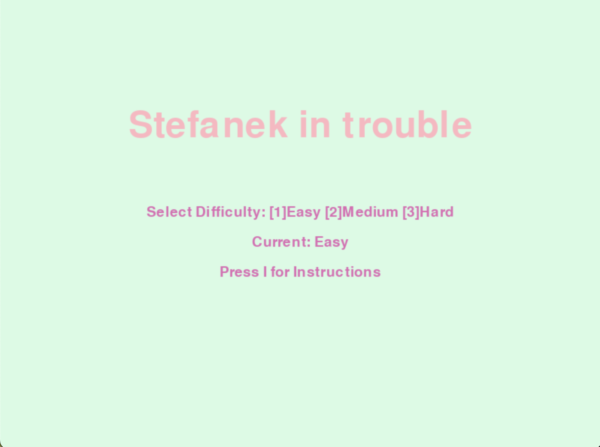
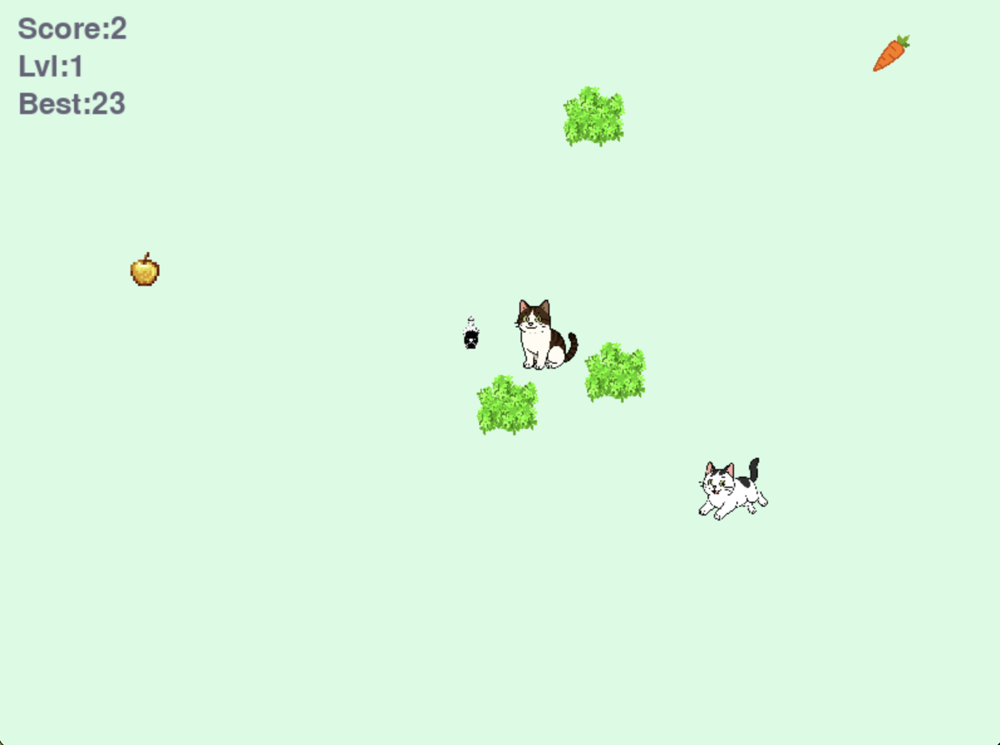
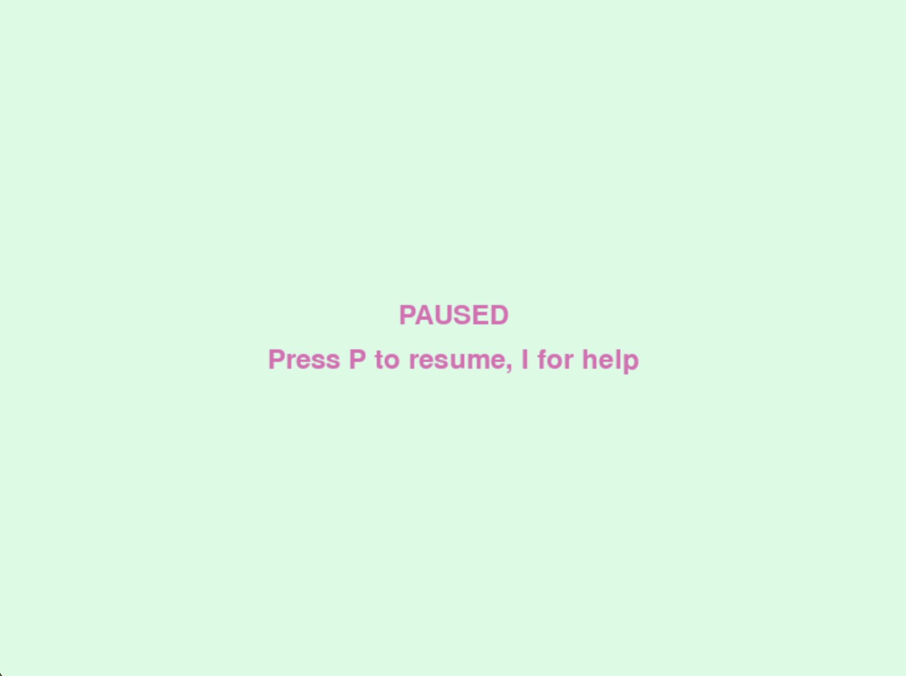
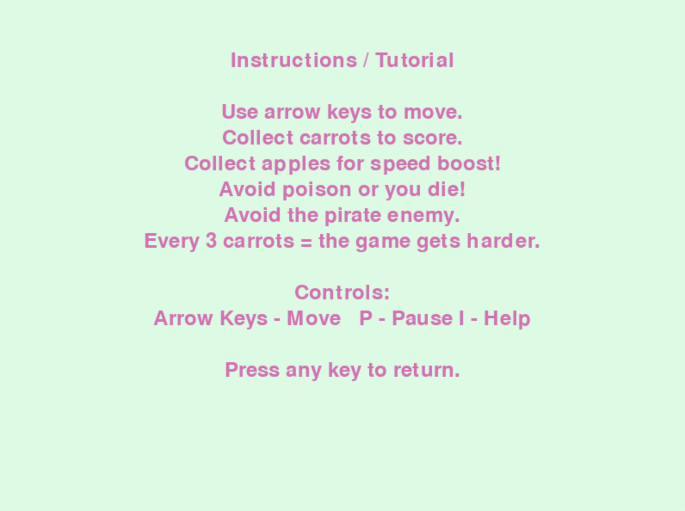
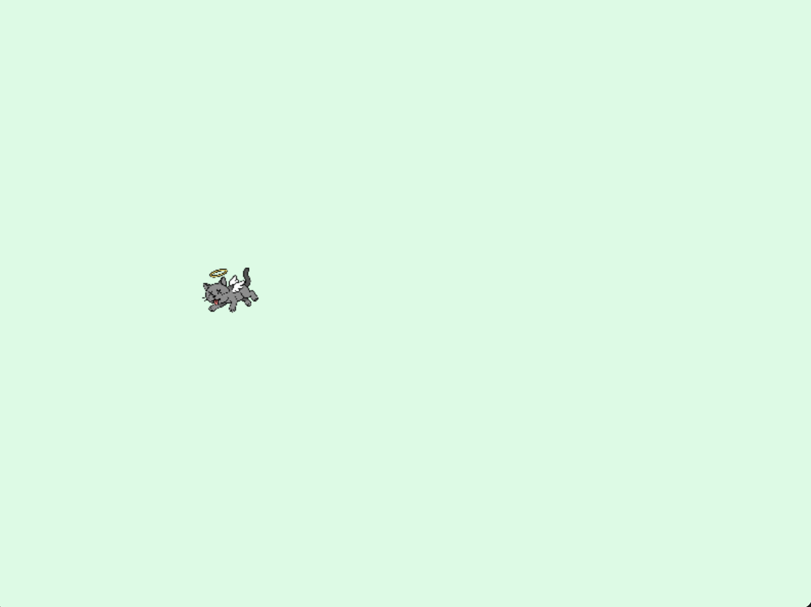
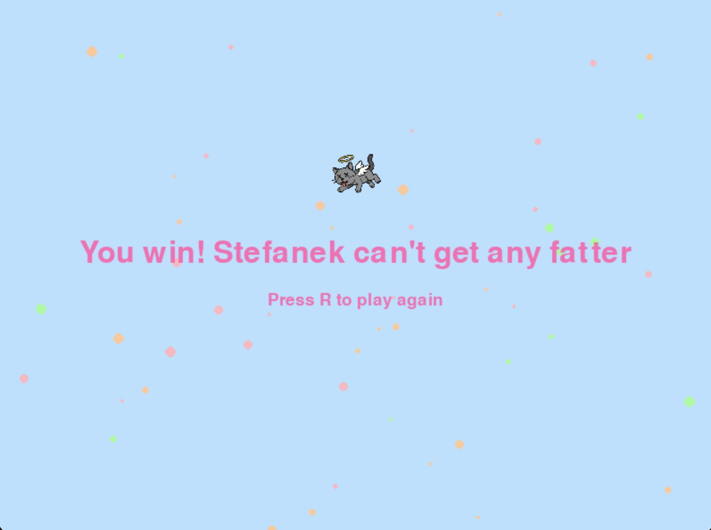
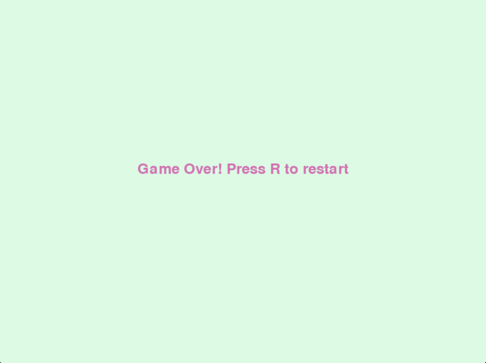

# Stefanek in trouble

**Stefanek in trouble** to gra akcji, w której sterujesz kotkiem Stefankiem. Celem jest zebranie jak największej liczby marchewek, unikanie kota - Pirata, przeszkód oraz trucizny, zbieranie power‑upów, w postaci złotych jabłek (to, co Stefanki lubią najbardziej) i osiągnięcie jak najwyższego wyniku.

## Sterowanie

- **Strzałki**: ruch (lewo, prawo, góra, dół)  
- **P**: pauza / wznowienie gry  
- **I**: ekran instrukcji  
- **R**: restart po przegranej  

## Mechaniki i power‑upy

- **Marchewki**: +1 punkt za każdą  
- **Jabłko**: chwilowy boost prędkości (15 sekund)  
- **Trucizna**: natychmiastowy koniec gry  
- **Poziomy**: co 3 marchewki rośnie poziom — więcej przeszkód i wyższa prędkość Pirata
- **Wygrana**: po zdobyciu 20 punktów Stefanek osiąga maksymalną wielkość, co kończy grę 
- **Śmierć**: animacja Stefanka odlatującego do nieba i ekran Game Over 

## Główne funkcje w kodzie

- `animate_fly_to_heaven(start_pos)`  
  Krótka animacja odlatywania ducha Stefanka z aureolą do kociego nieba po przegranej.  
- `spawn_obstacles(n, reserved)`  
  Generuje `n` krzaków w losowych miejscach, unikając prostokątów w `reserved`.  
- `spawn_item(obstacles)`  
  Generuje pojedynczy przedmiot (marchewka, jabłko lub trucizna) poza kolizją z przeszkodami.  
- `draw_text_centered(text, y_offset, color)`  
  Rysuje wyśrodkowany tekst na ekranie z opcją przesunięcia pionowego i koloru.  
- `draw_start_screen(selected)`  
  Wyświetla ekran startowy z tytułem, wyborem poziomu i instrukcją.  
- `draw_instructions_screen()`  
  Pokazuje szczegółowe instrukcje sterowania i mechanik.
- `draw_win_screen()`  
  Wyświetla ekran zwycięstwa z konfetti i obrazkiem Stefanka 
- `draw_game(...)`  
  Rysuje cały stan rozgrywki: tło, krzaki, przedmioty, gracza, wroga i HUD.  
- `run_game(ob_count, enemy_speed)`  
  Główna pętla gry, obsługa ruchu, AI wroga, kolizji i przejść między poziomami.  
- `game_over()`  
  Wyświetla ekran „Game Over” i czeka na naciśnięcie R w celu restartu.  

## Screenshots

 

  

